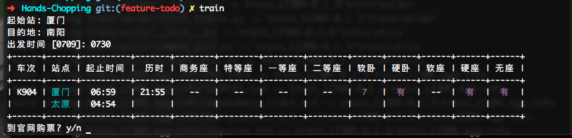

## spider-12306

[](https://travis-ci.org/ecmadao/Spider-12306)

最初的灵感来自于[PROTREAM](https://protream.github.io/)的博客[用Python写一个命令行火车票查看器](https://protream.github.io/post/build-a-command-line-train-tickets-query-tool-with-python/)，感谢他提供的车站名称转换链接，有了那个以后我就屁颠屁颠跑去写着玩了。

### 开发环境

python 3.5

### 第三方依赖

[prettytable](https://code.google.com/archive/p/prettytable/wikis/Tutorial.wiki)

打个广告，[python教程及笔记](https://github.com/ecmadao/Coding-Guide/tree/master/Notes/Python)戳这边，prettytable使用方法可见[Python语言及其应用-3(数据处理)](https://github.com/ecmadao/Coding-Guide/blob/master/Notes/Python/Python%E8%AF%AD%E8%A8%80%E5%8F%8A%E5%85%B6%E5%BA%94%E7%94%A8-3%EF%BC%88%E6%95%B0%E6%8D%AE%E5%A4%84%E7%90%86%EF%BC%89.md)

### USAGE

在项目目录下，

```bash
$ python3 tickets.py -h # 查看帮助
$ python3 tickets.py train [-g | -d | -t | -k | -z] <from> <to> [<date>] # 查票
```

example:

```bash
$ python3 tickets.py train 厦门 南阳 20160730 
# output
+------+------+----------+-------+--------+--------+--------+--------+------+------+------+------+------+
| 车次 | 站点 | 起止时间 |  历时 | 商务座 | 特等座 | 一等座 | 二等座 | 软卧 | 硬卧 | 软座 | 硬座 | 无座 |
+------+------+----------+-------+--------+--------+--------+--------+------+------+------+------+------+
| K904 | 厦门 |  06:59   | 21:55 |   --   |   --   |   --   |   --   |  8   |  有  |  --  |  有  |  有  |
|      | 太原 |  04:54   |       |        |        |        |        |      |      |      |      |      |
+------+------+----------+-------+--------+--------+--------+--------+------+------+------+------+------+
```

